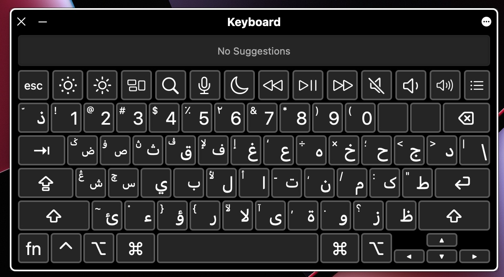
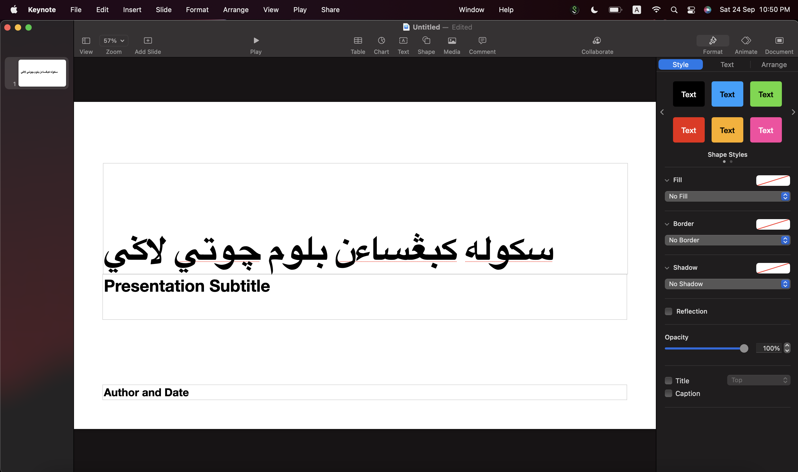
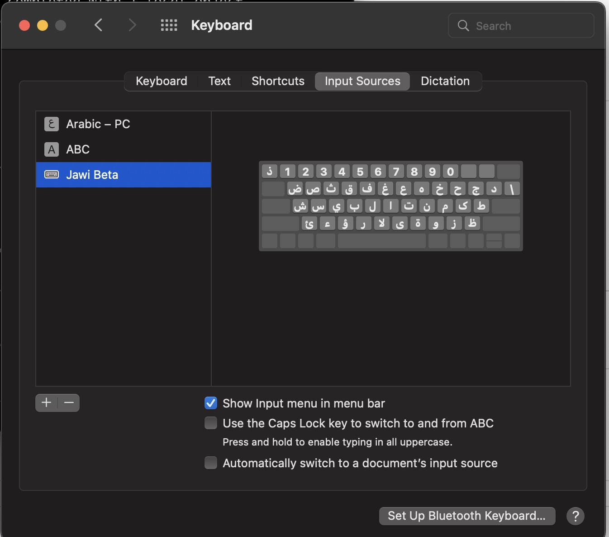

# Jawi4Mac
Ini adalah papan kekunci Jawi untuk sistem operasi macOS. Ianya mengikut papan kekunci Jawi UKM seperti berikut:



Contoh penggunaan pada aplikasi Keynote




Amaran: Ini adalah papan kekunci percubaan. Boleh digunakan secara percuma tanpa ada sebarang tanggungan. Segala kesulitan, renjatan elektrik, kerosakan komputer dan sebarang masalah adalah tanggungjawab sendiri. 

### Macam mana nak pasang?
1. Muat turun [Jawi Beta.keylayout](beta/Jawi%20Beta.keylayout)

2. Salin ia ke `/Library/Keyboard Layouts/`
```
sudo cp 'Jawi Beta.keylayout' '/Library/Keyboard Layouts/'
sudo chown $(whoami) '/Library/Keyboard Layouts/Jawi Beta.keylayout'
```
3. Logout dan login balik. Kemudian pilih keyboard `Jawi Beta` 


